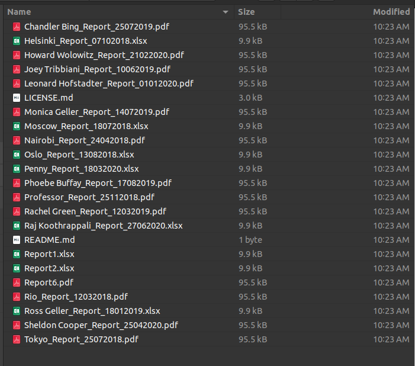
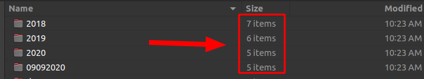
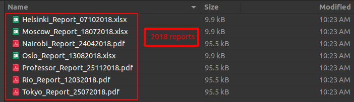
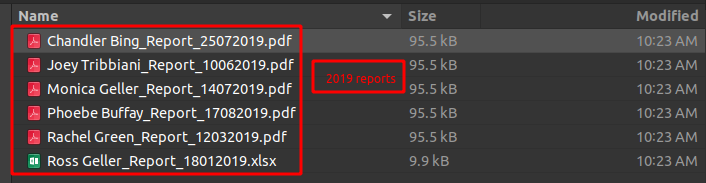

# Sorting Annual Reports

This repository contains robot process automation workflow for automating the task of sorting annual reports from a corpus. It takes time to manually sorting the appropriate files in appropriate folder but with this automation, it will take just seconds to properly sort the whole corpus of report.

### Automation contains 3 workflows:
1. [Save_Files.xaml](./workflow/Save_Files.xaml): Opens the URL and download the compressed files to the project folder
2. [Move_and Extract.xaml](./workflow/Move_and_Extract.xaml): Extract the files
3. [Folder_Creation.xaml](./workflow/Folder_Creation.xaml): Sort the files in appropriate folder. If folders are not present then it creates the folder.

### Before

[Click here](https://github.com/udacity/nd340-c1-intro-to-uipath-rpa-project-starter) to go the sample reports

### After

[Click here](https://github.com/udacity/nd340-c1-intro-to-uipath-rpa-project-starter) to go the sample reports

### License

Licensed under the [MIT License](./LICENSE.md) @ Udacity

### Issues/Bugs

Please open issues on github to report bugs or make feature requests

### Contribution

If you are interested in improving the code, please open an issue first to describe the task you are planning to do. For small fixes (a few lines of change) feel free to open pull requests directly.
